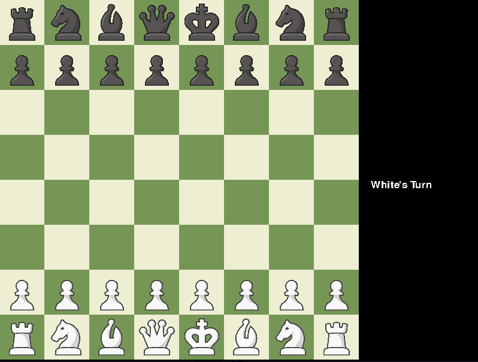

# Chess With Voice Recognition
 This is a simple chess game that can be played with one’s voice. For example, looking at the two images provided below a player will be able to say g1 – f3. This will select the knight located at g1 and move it to f3. Then the opponent will let the application know they are ready to do their turn and tell which piece to move and where to move it.



# Project Structure
- the `documents` folder will contain all the documents required for assigments: project proposal, Vision paper, Personas paper
- the `src` folder will contain all the code
- the `images` folder contains all the piece images


# How to run
To run the project simply clone the project:
```bash
git clone https://github.com/cis3296f22/04-voicechess
```
and 
```bash
python src/main.py 
```

# How to contribute
Make a PR

# How to build
- To build you are going to need to have python installed
- You are also going to need to install a couple of python packages which you can do with:
```bash
pip install SpeechRecognition pygame 
```

- The SpeechRecognition package provides the speech recognition 
- The pygame package provides the library for the GUI

