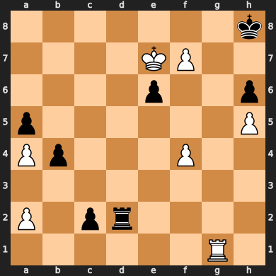

# Chess With Voice Recognition
 This is a simple chess game that can be played with one’s voice. For example, looking at the two images provided below a player will be able to say g1 – f3. This will select the knight located at g1 and move it to f3. Then the opponent will let the application know they are ready to do their turn and tell which piece to move and where to move it.


# Project Structure
- the `documents` folder will contain all the documents required for assigments: project proposal, Vision paper, Personas paper
- the `src` folder will contain all the code
- the `output` folder will contain output from the code
- the `audios` folder will contain audios used for testing


# How to run
To run the project simply clone the project:
```bash
git clone https://github.com/cis3296f22/04-voicechess
```
And then you can run a couple of executables:
1. `create_chess_board` with `python src/create_chess_board.py` this simply
creates a svg image of a chess board and puts it into the output folder
2. `live` with `python src/live.py` this is going to record your mic for about 5 secs and translate what you've said
3. `fromaudio` with `python src/fromaudio.py` same as before but it takes an audio file instead of using the mic

# How to contribute
Make a PR

# How to build
- To build you are going to need to have python installed
- You are also going to need to install a couple of python packages which you can do with:
```bash
pip install SpeechRecognition chess 
```
- The SpeechRecognition package provides the speech recognition 
- The chess package allows us to create the chess board

